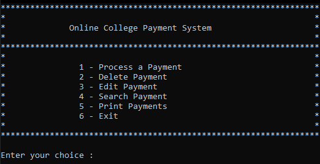

# Online College Payment System

  
This is a simple C++ project simulating an **Online College Payment System**. It allows users to manage student payment records with basic **CRUD operations** (Create, Read, Update, Delete) and saves the data into a `.txt` file for persistence.

  
- C++ (DevC++, TDM GCC 10.3.0)
- Other (OnlineGDB)  
- File handling via `.txt`  

---

-  : Add new student payment records  
-  : View all payment records  
-  : Modify existing records  
-  : Remove records permanently  
- Data saved in **text file** for persistence  

---

1. Open the project in **DevC++** or any C++ IDE.  
2. Compile the `.cpp` file.  
3. Run the executable.  
4. Follow the on-screen menu to perform CRUD operations.  

